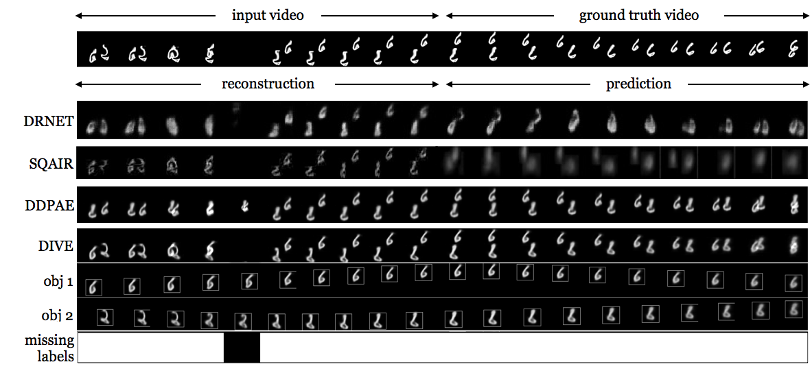

# Disentangled Imputed Video autoEncoder (DIVE)

Code for NeurIPS 2020 paper titled [Learning Disentangled Representations of Video with Missing Data](https://arxiv.org/abs/2006.13391).

Missing data poses significant challenges while learning representations of video sequences.
We present DIVE, a deep generative model that imputes and predicts future video frames in the presence of missing data.
Specifically, DIVE contributes by:
- Introducing a missingness latent variable,
- Disentangles the hidden video representations into static and dynamic appearance, pose, and missingness factors for each object and
- Imputing each object trajectory where data is missing.
This is done in an end-to-end training fashion and with using only self-supervision, by leveraging a VAE framework.

## Poster, Slides and video
Content will be available soon.

## Demo

Following we provide details to run both datasets presented in our paper. If you encounter a problem please feel free to contact the authors.
### Deformed and Missing-Data Moving MNIST

We prepare the code to be trained and tested for Scenario 3 of the experiments for Moving MNIST which includes:
- Out-of-scene (fully occluded) digits for 1 time-step
- Varying appearance following an elastic transformation, which is reduced linearly in time from very severe (alpha = 100) to inexistent.
All arguments are set by default for this scenario, but they can be changed at the users convenience. To better understand them, use the help command "-h" or refer to the "config.py" file.
For this experiment, missing labels are set to be soft.

A qualitative example of the expected results after 600 epochs (about 100k iterations) is:


Expected quantitative results can be found in the paper. For Scenario 1, change crop_size and set the flag use_crop_size to True in the config.py file.

After setting up the environment, we can train and test the code with:
```
cd DIVE/
python3 train.py
```
and
```
python3 eval.py
```
To view the results (while training in this case), execute the following commands:
```
cd tensorboard/ckpt/moving_mnist/dive/
tensorboard --logdir train_log --port 6006
```

## Installation
This codebase is trained and tested with Python 3.6+, Pytorch 1.2.0+ and Cuda 10.0+. We use tensorboardX 2.0. for visualization purposes.
We make use of [Pyro](http://pyro.ai/) 0.2 as our framework for probabilitstic programming. To better understand our model, we encourage the reader to browse their [Examples and Tutorials](https://pyro.ai/examples/).

### Moving MNIST
Download MNIST dataset from by running:
```
cd DIVE
mkdir moving_mnist
cd moving_mnist
wget http://yann.lecun.com/exdb/mnist/train-images-idx3-ubyte.gz
```
For this demo we don't provide our fixed test set. Instead we use an on-the-fly generated set for testing.

### MOTSChallenge Pedestrian
Download the MOTSChallenge pre-processed dataset [here](https://drive.google.com/file/d/1t3Z4ebREwaSrE5WxziuKdvjrllM4p-NM/view?usp=sharing). Allocate it in the directory that you find convenient.
Since the code is set for MovingMNIST experiments, some changes will have to be made to the config.py file.
We set image_size=[256, 256], crop_size=[256, 256], dset_dir: <em>data directory</em>, dset_name: "pedestrian", num_missing: 1, num_objects: 3, n_components: 3, hidden_size: 96, stn_scale_prior: 3.5 and gamma_switch_step = 5e3.

We use as the backbone of our implementation the available implementation for Decompositional Disentangled Predictive Auto-Encoder ([DDPAE](https://github.com/jthsieh/DDPAE-video-prediction)), as well as many of its functions, while it is built on Pyro.

## Citation

If you find this repository useful in your research, please cite our paper:
```
@article{Comas2020Dive,
  title={Learning Disentangled Representations of Video with Missing Data},
  author={Armand Comas Massague and Chi Zhang and Zlatan Feric and O. Camps and R. Yu},
  journal={Advances in neural information processing systems},
  year={2020},
}
